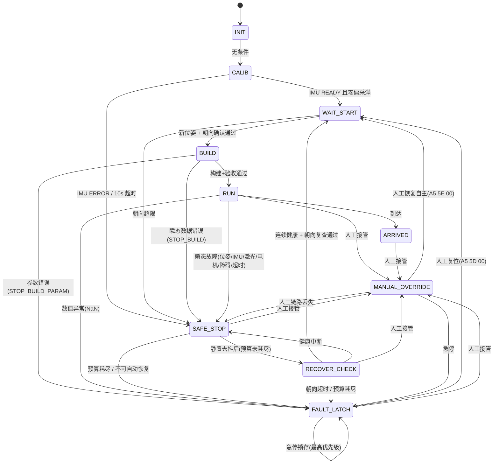
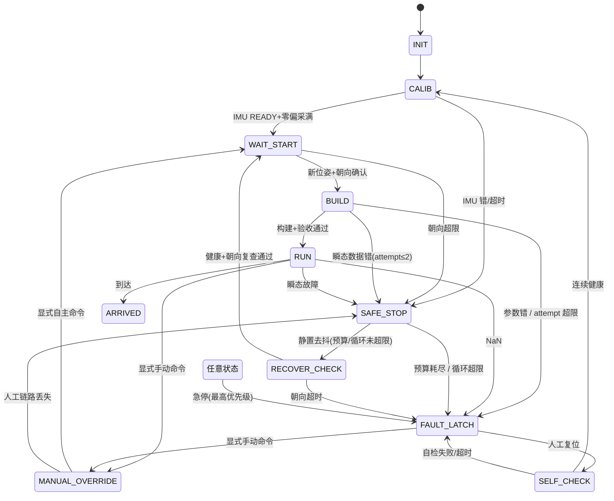

# path_main.c 状态机重设计（工业安全状态机）

> 本文件是**设计稿**。实现代码在 `user/path_planner/path_main.c` 等文件（D 阶段落盘）。
> 控制优先级贯穿全篇：**急停 Emergency Stop > 人工 Manual > 自主 Autonomous**。

---

## A. 新状态机图

### A.1 状态枚举（10 态）

```
INIT(0) → CALIB(1) → WAIT_START(2) → BUILD(3) → RUN(4) → ARRIVED(5)
                      ▲                    │
                      │                    └──(故障)──→ SAFE_STOP(6) → RECOVER_CHECK(7) →┘
                      │                                  │  ▲              │
                      │                                  │  └──────────────┘(健康窗口中断)
                      │                                  └──────────────→ FAULT_LATCH(8)
                      │
                      └──────────── MANUAL_OVERRIDE(9) ←── 任意状态的人工接管
```



恢复主流程（要求 2）：

```
RUN → SAFE_STOP → RECOVER_CHECK → WAIT_START → BUILD → RUN
```

### A.2 控制仲裁（优先级）

```
                     ┌─────────────────────────────┐
   操作手上位机        │   PathRunner_Arbitrate (1ms) │
  ┌─────────────┐     │   急停 > 人工 > 自主          │
  │ 急停帧 0x5D │ ──► │ 1) EstopLatched? → FAULT_LATCH│──► Chassis_StopAll
  │ 模式帧 0x5E │ ──► │ 2) Reset?        → WAIT_START │
  │ 速度帧 0x5A │ ──► │ 3) Mode=手动(显式 A5 5E 01) → MANUAL_OVERRIDE ─► Chassis_SetVelocity
  │ 动作帧 0x5B │ ──► │ 4) Auto → runner_step (RUN)   │──► Chassis_SetVelocity
  └─────────────┘     └─────────────────────────────┘
```

关键性质：
- **急停永不被屏蔽**：`ComputerLink_EstopLatched()` 在任何状态下都优先，直接锁存刹车、进入 FAULT_LATCH。
- **RUN 不再禁止人工**：收到**显式手动模式帧(A5 5E 01)**即切换到 MANUAL_OVERRIDE，自主挂起；普通速度/动作帧不触发切换。
- **单一底盘写入口**：`computer_link.c` 不再直接写底盘，统一由 `PathRunner_Arbitrate()` 仲裁。

---

## B. 状态转移表（每个状态五要素）

| 状态 | 进入条件 | 执行动作 | 退出条件 | 允许人工控制 | 允许自动恢复 |
|---|---|---|---|---|---|
| INIT(0) | 上电 `PathRunner_Init` | 关 IMU 航向保持 | 无条件 → CALIB | ✅ 仲裁器可拉 MANUAL/急停 | — |
| CALIB(1) | INIT | 每周期 `Chassis_StopAll`；采 200 帧陀螺零偏 | 采满 → WAIT_START；IMU ERROR/10s → SAFE_STOP | ✅（人可接管搬车） | ✅（SAFE_STOP） |
| WAIT_START(2) | CALIB 完成 / RECOVER_CHECK / FAULT_LATCH 复位 / MANUAL 恢复自主 | `StopAll`；等新位姿帧 + **朝向确认** | 新帧+朝向通过 → BUILD；朝向超限 → SAFE_STOP | ✅ | ✅ |
| BUILD(3) | WAIT_START | 建 B 样条+速度剖面+验收 | 通过 → RUN；瞬态数据错 → SAFE_STOP；参数错 → FAULT_LATCH | ✅ | ✅（瞬态） |
| RUN(4) | BUILD 通过 | 每 5ms 跟踪，写底盘 | 到达 → ARRIVED；瞬态故障 → SAFE_STOP；NaN → FAULT_LATCH；人工 → MANUAL_OVERRIDE | ✅（接管即 MANUAL） | ✅（SAFE_STOP） |
| ARRIVED(5) | RUN 到达 | `StopAll` 锁存 | 人工 → MANUAL_OVERRIDE；急停 → FAULT_LATCH | ✅ | ❌（人工决定） |
| SAFE_STOP(6) | 瞬态故障（`runner_safe_stop`） | 刹车锁存；静置去抖 | 去抖后 → RECOVER_CHECK；预算耗尽 → FAULT_LATCH；人工 → MANUAL_OVERRIDE；AUTO → WAIT_START；急停 → FAULT_LATCH | ✅ | ✅（窗口内） |
| RECOVER_CHECK(7) | SAFE_STOP 去抖完成 | 连续健康校验 + **朝向复查** | 健康窗口+朝向过 → WAIT_START；健康中断 → 停留；朝向超时 → FAULT_LATCH；人工/急停同上 | ✅ | ✅（校验本身） |
| FAULT_LATCH(8) | 确定性故障 / 急停 / 预算耗尽 | 刹车锁存，等待人工复位 | 复位帧 → WAIT_START（重新确认位姿+朝向）；人工 → MANUAL_OVERRIDE | ✅（人工接管/急停） | ❌（仅人工复位） |
| MANUAL_OVERRIDE(9) | 显式模式帧 A5 5E 01 | 按人工指令写底盘+动作；链路丢失 → SAFE_STOP | AUTO 帧 → WAIT_START；急停 → FAULT_LATCH | ✅（本态即人工） | ❌（仅人工确认恢复） |

### 故障→状态分类

| reason | 分类 | 落态 |
|---|---|---|
| STOP_UPPER_LOST / STOP_IMU_LOST / STOP_LASER_LOST / STOP_MOTOR_LOST / STOP_LASER_FRONT / STOP_TIMEOUT | 瞬态 | SAFE_STOP |
| STOP_BUILD | 瞬态（数据错误） | SAFE_STOP（恢复后重 BUILD） |
| STOP_HEADING | 瞬态（朝向） | SAFE_STOP（恢复期复查） |
| STOP_MANUAL_LINK | 瞬态但**不自动恢复** | SAFE_STOP（等人重新接管） |
| STOP_NUMERIC / STOP_BUILD_PARAM / STOP_ESTOP / STOP_RECOVER_FAIL | 永久 | FAULT_LATCH |

---

## C. 修改文件列表

| 文件 | 改动 |
|---|---|
| `user/path_planner/path_main.h` | 状态枚举 7→10；原因码扩展(15-18)；新增 `path_arb_t`、`PathRunner_Arbitrate()`、`PathPlanner_Arbiter()` |
| `user/path_planner/path_main.c` | 重写 FSM：SAFE_STOP/RECOVER_CHECK/FAULT_LATCH/MANUAL_OVERRIDE；新增仲裁器；恢复预算改滚动窗口；heading gate 按布防重确认；BUILD 瞬态/参数分流 |
| `user/path_planner/path_config.h` | 恢复参数：`PATH_RECOVER_WINDOW_MS`、`PATH_RECOVER_SETTLE_MS`、`PATH_RECOVER_HEADING_TIMEOUT_MS`（替换旧 `PATH_RECOVER_MS/MAX_TIMES` 语义） |
| `user/com_link/computer_link.c` | 解析急停帧(0x5D)/模式帧(0x5E)；**不再直接写底盘**，改为提交；暴露 Estop/Reset/Manual/Auto/GetCommand/GetAction/LinkOnline |
| `user/com_link/computer_link.h` | `computer_cmd_t` 提升到头文件；新增仲裁接口声明 |
| `Core/Src/freertos.c` | commTask 循环加入 `PathRunner_Arbitrate()`（USER CODE 区，安全） |

协议新增（需操作手侧后续配合，见遥测.md 风格）：

| 帧 | 负载 | 含义 |
|---|---|---|
| `A5 5D 01` | 急停 | 锁存急停 → FAULT_LATCH |
| `A5 5D 00` | 急停清除/复位 | 清急停 + 清 FAULT_LATCH → WAIT_START |
| `A5 5E 01` | 模式=手动 | 显式请求人工接管 |
| `A5 5E 00` | 模式=自主 | 人工确认恢复自主 → WAIT_START |

---

## D. 实现（已完成）

D 阶段按 C 表落地完毕：

1. `path_main.h` — 状态枚举 7→10、原因码扩展(15-19)、`path_arb_t` 与 `PathRunner_Arbitrate/PathPlanner_Arbiter` 声明；
2. `path_config.h` — 恢复参数改为滚动窗口（`PATH_RECOVER_WINDOW_MS`/`SETTLE`/`HEADING_TIMEOUT`）；
3. `computer_link.h/.c` — 解析急停帧(0x5D)/模式帧(0x5E)，改为“提交层”，暴露仲裁查询接口；
4. `path_main.c` — 重写 FSM（SAFE_STOP/RECOVER_CHECK/FAULT_LATCH/MANUAL_OVERRIDE）、新增仲裁器、恢复预算滚动窗口、heading gate 按布防重确认、BUILD 瞬态/参数分流；
5. `freertos.c` — commTask 接入 `PathRunner_Arbitrate()`。

**待操作手侧配合**（非本次改动范围）：上位机/遥控需按上表新增急停帧与模式帧的发送（否则急停/复位/恢复自主只能靠速度帧隐式接管）。`path_planner/README.md` 中旧状态机描述（0~6、STOPPED、`PathPlanner_OwnsChassis`）也已过时，建议后续同步。


---

# 第二轮审查（2026-08-15）

针对五项审查点，对第一轮 FSM 做了修订，并给出可达性/退出/循环风险分析。

## 审查结论速览

| # | 审查点 | 结论 | 处置 |
|---|---|---|---|
| 1 | MANUAL_OVERRIDE 被普通帧误触发 | **是（第一轮存在）**：速度/动作帧会触发切换 | 改为仅 `A5 5E 01` 显式模式命令触发；自主态丢弃未授权速度/动作帧 |
| 2 | SAFE_STOP 无限循环 | **存在**：同因同位可无限停-启-停 | 增加故障上下文 `fault_pose/fault_reason/fault_timestamp` + 循环计数，超限升级 FAULT_LATCH |
| 3 | BUILD 自动恢复无 attempt 限制 | 第一轮无限重试 | 增加 `build_fail_count` + `PATH_BUILD_RECOVER_MAX`，超限锁存 |
| 4 | FAULT_LATCH 复位直接回 WAIT_START | 跳过了标定 | 复位 → **SELF_CHECK → CALIB** → WAIT_START |
| 5 | 状态爆炸 | 状态=控制轴(11 个，有界)；故障=数据轴(fault_code) | 采用 **state + fault_code** 正交设计 |

## 1. 新状态图（11 态）

```
INIT(0) → CALIB(1) → WAIT_START(2) → BUILD(3) → RUN(4) → ARRIVED(5)
                      ▲                          │
                      │               ┌─(瞬态故障)─┘
                      │               ▼
                      │         SAFE_STOP(6) → RECOVER_CHECK(7) ──┐
                      │               │(预算/循环超限)            │(健康+朝向复查通过)
                      │               ▼                          ▼
                      │         FAULT_LATCH(8) ←────────────── WAIT_START
                      │               │(人工复位 A5 5D 00)
                      │               ▼
                      │         SELF_CHECK(10) → CALIB → WAIT_START → BUILD → RUN
                      │               │(自检失败/超时 → FAULT_LATCH)
                      │
                      └── MANUAL_OVERRIDE(9) ←─ 显式 A5 5E 01(任何状态)
                            │(A5 5E 00) → WAIT_START
```



## 2. 状态可达性分析

| 状态 | 可达路径（前驱） |
|---|---|
| INIT | 上电唯一入口 |
| CALIB | INIT；SELF_CHECK（重新标定） |
| WAIT_START | CALIB 完成；RECOVER_CHECK 通过；MANUAL→AUTO；FAULT_LATCH 复位后经 SELF_CHECK→CALIB |
| BUILD | WAIT_START（位姿+朝向确认通过） |
| RUN | BUILD 验收通过 |
| ARRIVED | RUN 到达 |
| SAFE_STOP | RUN/CALIB/WAIT_START/BUILD 瞬态故障；MANUAL 链路丢失 |
| RECOVER_CHECK | SAFE_STOP 静置去抖通过 |
| FAULT_LATCH | 永久故障(NaN/参数BUILD/自检失败)；急停；预算耗尽；循环超限 |
| SELF_CHECK | FAULT_LATCH 人工复位 |
| MANUAL_OVERRIDE | 任意状态收到显式手动命令 A5 5E 01（急停态除外，急停优先） |

**结论**：11 态全部可达；无不可达死态。

## 3. 所有状态退出路径（是否有出口）

| 状态 | 退出边 | 是否为汇(sink) |
|---|---|---|
| INIT | →CALIB（无条件） | 否 |
| CALIB | →WAIT_START / →SAFE_STOP | 否 |
| WAIT_START | →BUILD / →SAFE_STOP / →MANUAL_OVERRIDE / →FAULT_LATCH(急停) | 否 |
| BUILD | →RUN / →SAFE_STOP / →FAULT_LATCH / →MANUAL_OVERRIDE | 否 |
| RUN | →ARRIVED / →SAFE_STOP / →FAULT_LATCH / →MANUAL_OVERRIDE | 否 |
| ARRIVED | →MANUAL_OVERRIDE / →FAULT_LATCH(急停) | 半汇：**需人工**（符合预期，终点锁存） |
| SAFE_STOP | →RECOVER_CHECK / →FAULT_LATCH / →MANUAL_OVERRIDE / →WAIT_START(AUTO) | 否 |
| RECOVER_CHECK | →WAIT_START / →FAULT_LATCH / →MANUAL_OVERRIDE | 否 |
| FAULT_LATCH | →SELF_CHECK(复位) / →MANUAL_OVERRIDE / 急停自持 | 半汇：**需人工**（锁存语义） |
| SELF_CHECK | →CALIB / →FAULT_LATCH | 否 |
| MANUAL_OVERRIDE | →WAIT_START(AUTO) / →SAFE_STOP(链路丢失) / →FAULT_LATCH(急停) | 否 |

**结论**：每个状态都有出口；仅 ARRIVED / FAULT_LATCH 是“需人工”的半汇（这是安全语义，不是缺陷）。

## 4. 自动循环风险分析

| 循环 | 防护层 | 是否仍可能无限 |
|---|---|---|
| RUN→SAFE_STOP→RECOVER_CHECK→WAIT_START→BUILD→RUN（同因同位） | 故障上下文 `fault_pose+fault_reason+fault_timestamp` + `loop_count≥PATH_LOOP_MAX(3)` → FAULT_LATCH | ❌ 有界 |
| 恢复次数无限 | 滚动窗口 `PATH_RECOVER_WINDOW_MS(60s)` 内 `PATH_RECOVER_MAX_TIMES(3)` | ❌ 有界 |
| BUILD 失败无限重试 | `build_fail_count ≥ PATH_BUILD_RECOVER_MAX(2)` → FAULT_LATCH | ❌ 有界 |
| 贴墙障碍停-启-停 | 激光恢复要求障碍清除(>14cm)或墙吻合；同因同位循环超限也锁存 | ❌ 有界 |
| 位姿抖动反复触发 STOP_BUILD | 同因同位 + 时间窗 → 循环计数 → 锁存 | ❌ 有界 |

**结论**：自动循环有界，最多 `MAX(3,3,2)` 次后必进 FAULT_LATCH（人工介入），不会无限。

## 5. state + fault_code 正交设计（防状态爆炸）

- **state 轴**（`path_state_t`，11 个）：回答“**机器在做什么**”——模式/控制流程，**有界、闭合**，不随故障种类增长。
- **fault_code 轴**（`path_reason_t`，22 个）：回答“**为什么停/最近故障是什么**”——数据，可无限扩展，**不产生新状态**。
- **fault context**（`path_fault_ctx_t`）：`code + pose(x,y) + timestamp`，供循环检测与遥测，不占用状态。
- 状态机只在“瞬态(可恢复) / 永久(需人工) / 人工接管”三类控制语义间跳转；新增一个故障种类只需加一个 reason 枚举值 + 分类表，**状态数量保持不变**。

## 6. 本轮代码修改

| 文件 | 改动 |
|---|---|
| `path_main.h` | +SELF_CHECK 状态；+reason 20-22；+`path_fault_ctx_t`；debug 增加 fault 字段 |
| `path_config.h` | +`PATH_SELFCHECK_MS/TIMEOUT`、`PATH_BUILD_RECOVER_MAX`、`PATH_LOOP_*` |
| `computer_link.c` | `ComputerLink_ManualRequested` 仅认显式模式帧，速度/动作帧不再触发切换 |
| `path_main.c` | +故障上下文/循环检测/`build_fail`/`PathFusion_ResetCalib`；+SELF_CHECK；复位→SELF_CHECK；自主态丢弃未授权手动帧 |

> 遗留（需操作手侧）：上位机/遥控需实现 `A5 5E 01/00` 模式帧与 `A5 5D 01/00` 急停帧，否则“显式模式切换”语义下人工接管需先发模式帧。
