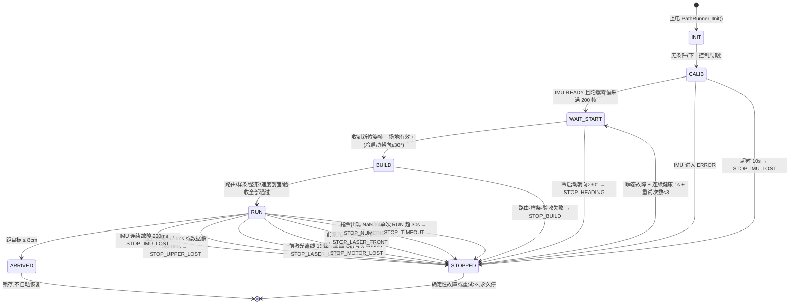
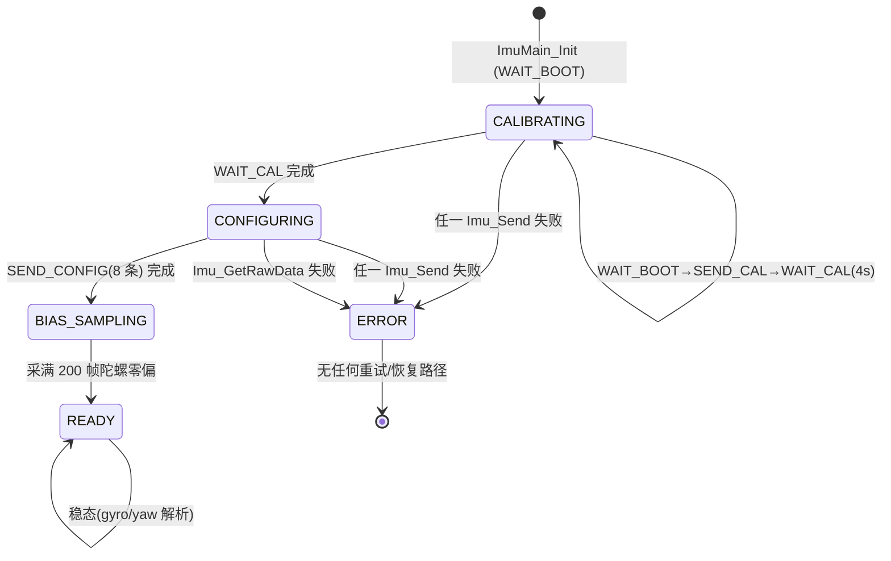
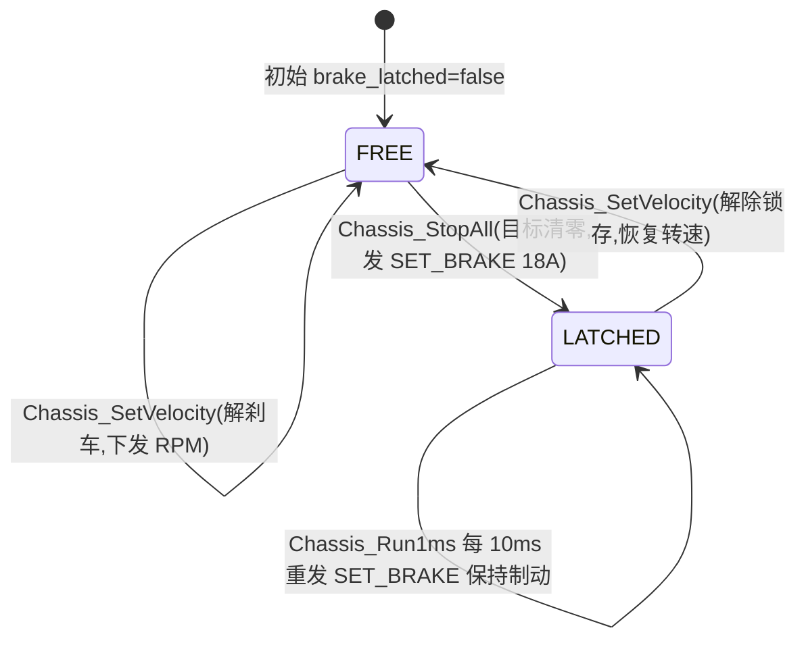
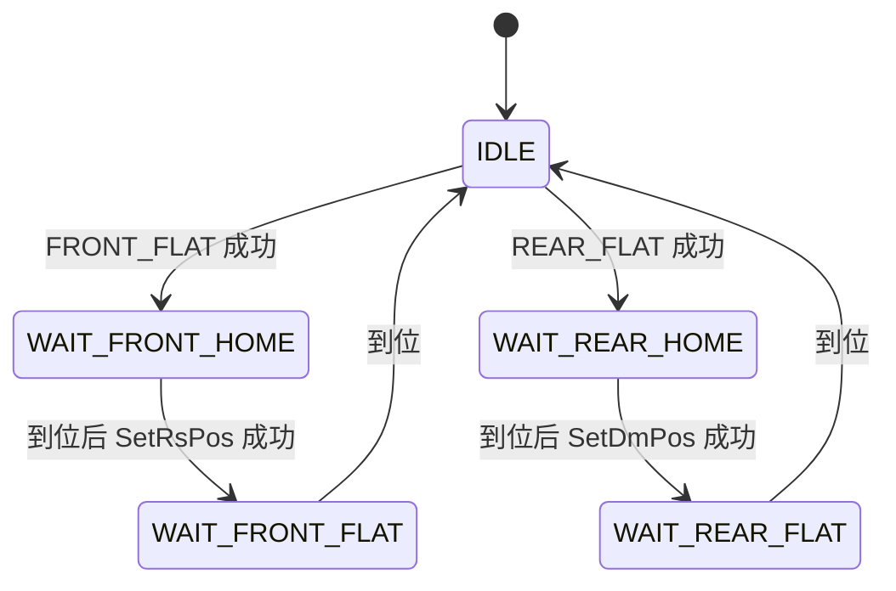
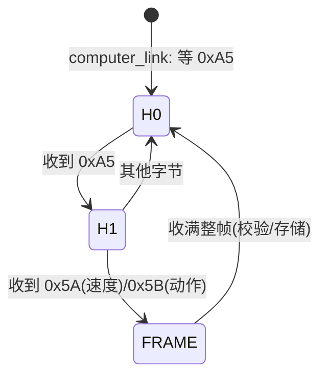

# 太升（taisheng）底盘/路径控制 —— 状态机、转换与故障路径分析

> 分析对象：`user/`（STM32H7 主控板）。核心在 `user/path_planner/path_main.c`（导航主状态机）、
> `user/chassis_vesc/chassis_main.c`（底盘 + 刹车锁存）、`user/com_link/computer_link.c`（人工/上位机遥控指令仲裁）、
> `user/imu/imu_main.c`（IMU 初始化状态机）、`Core/Src/freertos.c`（任务时序）。
> 本次只做**静态代码走查与画图**，未修改任何代码。

---

## 1. 系统结构与任务时序

```
commTask(1ms)   : DT35PnpLink_Run → Action_UpdatePnp → ComputerLink_Run(人工指令/失联急停)
                  → PcLink_Run(0x11 位姿解析) → PathRunner_Run(5ms 分频,最后执行,覆盖人工)
chassisTask(1ms): ImuMain_Run1ms → Chassis_Run1ms(每 10ms 下发 VESC)
liftTask(1ms)   : Action_Run1ms → Up_Run1ms
```

关键点：**`PathRunner_Run` 在 commTask 里最后执行**，因此它每 5ms 都会覆盖 `ComputerLink_Run` 刚下发的人工速度
（详见 §4.2）。

数据流：小电脑 0x11 位姿(UART7) + IMU gyro(USART1) + 前/左激光 DT35(UART9) → 融合 → 轨迹跟踪
→ `Chassis_SetVelocity` → FDCAN1 → 4×VESC。反向每 50ms 回传 0x20 状态帧（`state` + `error`）。

---

## 2. 状态机总图

### 2.1 主状态机 —— 路径规划器（`path_main.c`）

7 个状态（`path_state_t`，path_main.h:49-58），停机原因码（`path_reason_t`，path_main.h:61-77）。



**状态语义**

| state | 含义 | 离开条件 |
|---|---|---|
| 0 INIT | 上电，关 IMU 航向保持 | 无条件 → CALIB |
| 1 CALIB | 静止采集陀螺零偏（200 帧） | 采满 → WAIT_START；IMU 错/10s 超时 → STOPPED |
| 2 WAIT_START | 等小电脑位姿 + 冷启动朝向门 | 新帧+有效 → BUILD；朝向>30° → STOPPED |
| 3 BUILD | 建 B 样条 + 速度剖面 + 验收 | 通过 → RUN；失败 → STOPPED |
| 4 RUN | 沿线跟踪（每 5ms） | 到点 → ARRIVED；故障 → STOPPED |
| 5 ARRIVED | 到达终点 | 锁存（仅人工/断电） |
| 6 STOPPED | 异常停止 | 瞬态且<3 次 → 健康 1s → WAIT_START；否则永久 |

**停机原因码（0x20 状态帧 `error` 字段）**

| 码 | 枚举 | 触发 | 去抖 | 可自动恢复 |
|---|---|---|---|---|
| 4 | LASER_SLOW | 前激光降速（非停机，正常） | — | — |
| 6 | STOP_LASER_FRONT | 前激光≤12cm 非期望墙 | 3 点中值 | ✅ 瞬态(须清障>14cm) |
| 7 | STOP_UPPER_LOST | 位姿丢失>500ms / 数据龄>800ms | **无** | ✅ 瞬态 |
| 8 | STOP_IMU_LOST | IMU 故障 200ms / CALIB 失败 | 200ms | ✅ 瞬态 |
| 9 | STOP_LASER_LOST | 前激光离线 1500ms | 1500ms | ✅ 瞬态 |
| 10 | STOP_BUILD | 轨迹构建/验收失败 | — | ❌ 确定性 |
| 11 | STOP_NUMERIC | NaN/Inf | — | ❌ 确定性 |
| 12 | STOP_MOTOR_LOST | 电机离线 400ms | 400ms | ✅ 瞬态 |
| 13 | STOP_HEADING | 冷启动朝向>±30° | 仅查一次 | ❌ 确定性 |
| 14 | STOP_TIMEOUT | 单次 RUN>30s | — | ❌ 确定性 |

### 2.2 IMU 状态机（`imu_main.c`）

对外 6 态（imu_main.h:9-17），内部初始化子步 8 态（imu_main.c:55-59）。



**注意：`ERROR` 是终态**——`run_init_state` 的 `case IMU_INIT_ERROR` 只 `break`，没有任何重试逻辑；
`ImuMain_Init` 若 `Imu_Init(&huart1)` 失败则 `initialized=false`，`ImuMain_Run1ms` 直接早退且 chassisTask 不再调用它
（freertos.c:222）。后果见 §4.1/A2。

### 2.3 底盘刹车锁存（`chassis_main.c`）



故障安全（P0-6）：所有 `runner_stop`/到达 都走 `Chassis_StopAll` → 锁存制动；只有 `Chassis_SetVelocity`
（人工或规划器）才能解锁。

### 2.4 动作层 / 抬升（`action_api.c`，次要）



> 若某电机离线，`Up_MotorMoveDone()` 永远 false，则停在 WAIT_* 态；只阻塞本动作序列，不影响底盘。
> RS/DM 电机层还有 `RS_RESET/RS_CALI/RS_RUN`、DM 故障码等，此处不展开。

### 2.5 通信解析状态机（字节级，`computer_link.c` / `pc_link.c` / `dt35_pnp_link.c`）



`pc_link.c`：`WAIT_HEADER_0(AA) → WAIT_HEADER_1(55) → WAIT_TYPE(10/11) → COLLECT`。
`dt35_pnp_link.c`：`index 0 等 0xAA/0xAB → 收满 5B → 校验 → 存储`。这些均为有界/自愈（错误→restart_requested 重建）解析器，无死循环。

---

## 3. 故障路径总表（`runner_stop` 全部触发点）

`runner_stop(reason)`（path_main.c:1615-1624）＝ `state=STOPPED` + `Chassis_StopAll()`（刹车锁存）。

| # | 位置(行) | 状态 | 触发条件 | 去抖 | reason | 可恢复 |
|---|---|---|---|---|---|---|
| 1 | 2275 | CALIB | `imu.state==ERROR` | — | STOP_IMU_LOST | 名义瞬态,实际不恢复(IMU 已终态) |
| 2 | 2280 | CALIB | `now-state_start>10s` | — | STOP_IMU_LOST | 名义瞬态 |
| 3 | 2313 | WAIT_START | 冷启动 `|yaw|>30°` | 仅一次 | STOP_HEADING | ❌ 永久 |
| 4 | 2357/2365/2372/2380/2407 | BUILD | 路由/加密/样条/整形/验收失败 | — | STOP_BUILD | ❌ 永久 |
| 5 | 1961 | RUN | `!HasUpper \|\| IsUpperLost(500ms)` | **无** | STOP_UPPER_LOST | ✅ 瞬态 |
| 6 | 1966 | RUN | `DataAge>800ms` | **无** | STOP_UPPER_LOST | ✅ 瞬态 |
| 7 | 1984 | RUN | IMU 故障 200ms | 200ms | STOP_IMU_LOST | ✅ 瞬态 |
| 8 | 2000 | RUN | 前激光离线 1500ms | 1500ms | STOP_LASER_LOST | ✅ 瞬态 |
| 9 | 2016 | RUN | 电机离线 400ms | 400ms | STOP_MOTOR_LOST | ✅ 瞬态 |
| 10 | 2020 | RUN | 单次 RUN>30s | — | STOP_TIMEOUT | ❌ 永久 |
| 11 | 2032 | RUN | 到达(≤8cm) | — | ARRIVED(非故障) | ❌ 锁存 |
| 12 | 2122 | RUN | 前激光≤12cm 非期望墙 | 中值滤波 | STOP_LASER_FRONT | ✅ 瞬态(须清障) |
| 13 | 2189 | RUN | 指令 NaN/Inf | — | STOP_NUMERIC | ❌ 永久 |

恢复逻辑（STOPPED 分支，path_main.c:2427-2490）：仅 `STOP_UPPER_LOST/STOP_IMU_LOST/STOP_LASER_LOST/
STOP_MOTOR_LOST/STOP_LASER_FRONT` 属“瞬态”；`recover_count<3` 时，连续健康 `PATH_RECOVER_MS=1000ms`
后 `recover_count++` → `WAIT_START`（重新布防）。健康判据 = `imu_ok && lf_ok && motors_online && !upper_lost && has_upper`；
对 LASER_FRONT 追加“读数>14cm 或贴墙吻合（`laser_wall_ok`）”。

---

## 4. 四类问题路径

### 4.1 “进入后无法回到 RUN”

**A1 —— 确定性故障进入 STOPPED 后永远回不到 RUN（无任何复位入口）**

```
INIT → CALIB → WAIT_START → (冷启动 |yaw|>30°) → STOPPED(STOP_HEADING)  → 永久
INIT → CALIB → WAIT_START → BUILD → (构建失败) → STOPPED(STOP_BUILD)    → 永久
INIT → … → RUN → (单次>30s) → STOPPED(STOP_TIMEOUT)                     → 永久
```

`STOP_HEADING/STOP_BUILD/STOP_NUMERIC/STOP_TIMEOUT` 不在瞬态列表（path_main.c:2432-2437），
STOPPED 分支对它们什么都不做，**状态机里没有“回到 INIT/CALIB 的边”**。
全仓库也没有任何“复位/重启规划器”的指令入口：`PcLink` 只有写状态帧（`PcLink_SetStatus`），
`ComputerLink` 只有速度/动作帧。因此这几类停机后**只能断电重启**才能再回 RUN。

其中 `STOP_BUILD` 尤其可疑：BUILD 内 `PATH_BUILD_MAX_ATTEMPTS=3` 只覆盖“整形+验收”小循环，
而更前面的 `build_route`/`densify_route`/`PathSpline_Build` 失败（2357/2365/2372/2380）**没有重试**，
一次瞬时坏位姿即可永久锁死（见 §4.4/D2）。

**A2 —— IMU 初始化失败 = 永久 ERROR，规划器永远到不了 RUN**

```
ImuMain_Init: Imu_Init(&huart1)!=OK → initialized=false → ImuMain_Run1ms 永远不执行(无重试)
run_init_state: 任一 Imu_Send!=OK → set_error_state() → IMU_INIT_ERROR(终态,无重试)
  └─ 规划器 CALIB 需要 imu.state==READY ⇒ 10s 后 STOPPED(STOP_IMU_LOST)
  └─ STOP_IMU_LOST 虽属瞬态,但恢复健康判据含 imu_ok(=READY) ⇒ 永远 false ⇒ 永久 STOPPED
```

一次瞬态 UART 发送失败（`HAL_UART_Transmit` 偶发 BUSY）即让 IMU 与规划器双双永久失效。

**A3 —— 底盘初始化失败不被规划器感知，最终同样永久锁死**

`Chassis_Init` 失败 → `chassis_ready=false` 且 chassisTask 不再调 `Chassis_Run1ms`（无重试）。
但 `PathRunner` 不检查 `chassis_ready`，会照常 CALIB→WAIT_START→BUILD→**RUN**；进 RUN 后
`motors_online()` 恒 false → 400ms 后 `STOP_MOTOR_LOST` → 恢复健康判据恒 false → 永久 STOPPED。
（表现为“能进 RUN 但立刻死”，也是回不到可用 RUN。）

### 4.2 “无法人工接管”

**B1 —— RUN 期间人工指令被完全屏蔽，连失联急停也被屏蔽（最主要）**

`PathPlanner_OwnsChassis() = (state==RUN)`（path_main.c:2517-2521）。`ComputerLink_Run` 里三处都用
`!PathPlanner_OwnsChassis()` 作门控（computer_link.c:255 / 259 / 268-272）：

```c
if (has_command && !PathPlanner_OwnsChassis()) Chassis_SetVelocity(...);   // 人工速度被丢弃
if (has_action  && !PathPlanner_OwnsChassis()) Action_Request(...);        // 动作被丢弃
if (link_online && 超时500ms && !PathPlanner_OwnsChassis()) Chassis_StopAll(); // 失联急停也被丢弃
```

后果：机器人在 RUN 中异常时（README 明确列出的“原地打转 / 朝墙冲”等），**操作手没有任何远程干预手段**：
速度、动作、失联兜底急停全部失效。只能断电，或等某个故障（激光急停 / 30s 超时）先把它踢进 STOPPED，
再在 STOPPED 里接管。这是“RUN 独占底盘”设计的直接结果，但意味着自主运动期间**没有人工急停通道**。

**B2 —— CALIB/WAIT_START 期间人工速度被 `Chassis_StopAll` 每 5ms 覆盖**

commTask 顺序：`ComputerLink_Run`(先,下发人工速度) → `PathRunner_Run`(后)。
而 `PathRunner_Run` 在 CALIB（2260）与 WAIT_START（2293）**每控制周期调 `Chassis_StopAll()`**，
重新锁死刹车。于是人工速度在 1ms 下发、5ms 内被 StopAll 覆盖，表现为“给油门没反应/反复急刹”。
→ 人工实际只在 **ARRIVED / STOPPED**（以及 1 个 tick 的 INIT）有效，与 README“ARRIVED/STOPPED 后遥控可直接接管”一致。

**B3 —— 自动重布防会在操作手接管前把机器人重新拉回 RUN**

```
STOPPED(瞬态) → 健康1s → WAIT_START → BUILD → RUN（再次屏蔽人工）
```

操作手只有约 1s 的 STOPPED 窗口能发指令；一旦重布防进入 RUN，人工又被屏蔽。
系统里**没有“取消自动重布防 / 保持手动”的机制**，操作手无法在故障恢复期间声明接管。

### 4.3 “无限循环”

**C1 —— 停-启-停 循环（受 3 次上限约束，非代码级死循环，但反复冲撞/急刹）**

```
RUN →(障碍/瞬态故障)→ STOPPED →(健康1s)→ WAIT_START → BUILD → RUN → …
```

`recover_count<3` 限制（path_main.c:2438），3 次后永久 STOPPED。真正的问题在于**每次重布防都会重置
`run_start_ms`**（path_main.c:2414），而 `PATH_MAX_RUN_MS=30s` 是**“单次 RUN”计时，不是“全程”计时**。
因此“全程 30s 超时”这道安全边界被削弱：理论上可 RUN≈30s→故障→重布防→再 RUN≈30s……3 次 ≈ 2 分钟以上，
期间人工又被屏蔽（见 B1）。

**C2 —— 代码内无无界忙等/死循环**

逐处核对：`PathWrapAngle` 的 `while`（323/327）依赖角度有界（输入 yaw 有 |yaw|≤2π 门；NaN 时比较为假直接返回，
由 `num_ok` 兜底）；`deboor`（408）、`resample_uniform`（1590）、整数转字符串（2572）等均为有界循环；
`densify_route` 对点数溢出是“判失败返回 0”而非静默截断。→ 结论：**无代码级死循环，
“循环”风险集中在状态级的停-启-停 + 超时重置**。贴墙通道恢复死锁（README 所述）已用 `laser_wall_ok`
（1647）缓解，走查未见残留绝对阈值死锁。

### 4.4 “错误升级”（把可恢复/可纠正升级为永久）

**D1 —— 瞬态故障重试 3 次耗尽后永久锁死**

`recover_count` 只增不重置（声明 1366，自增 2475，`PathRunner_Init` 也不清它）。一旦累计 3 次——
**无论此刻所有传感器是否已全部健康**——`transient && recover_count<3` 恒假，STOPPED 永不恢复。
典型：固定障碍挡路，机器人反复“出车→撞停”，3 次后即使人把障碍搬走，它也不再尝试，需断电。
这是把“可恢复的瞬态故障”升级为“永久停机”。

**D2 —— 可自愈条件被划为“确定性”**

- `STOP_BUILD`：构建失败即永久（无自动重试，见 A1）。BUILD 入口处的位姿来自 WAIT_START 单帧融合结果，
  瞬时坏帧/边缘路由即可造成一次性构建失败 → 永久。
- `STOP_HEADING`：冷启动朝向>30° 即永久，不自动复查。人把车摆正后**也没有恢复路径**，只能断电。
  （代码注释明确记录过反向问题——“恢复重布防时再查朝向门会把瞬态故障恢复机会吃光变永久锁死（审计大问题 C）”，
  现改为只查一次；但残余是：冷启动那一次朝向超限仍是永久停。）
- `STOP_UPPER_LOST`：**无去抖**（1961/1966），与 IMU 200ms / 电机 400ms / 激光 1500ms 的去抖策略不一致，
  单次 500ms 链路空窗立即停机；虽然可恢复，但恢复要先“健康 1s”，存在过激。

**D3 —— IMU 单次发送失败升级为永久 ERROR（见 A2）**

`run_init_state` 任一 `Imu_Send!=OK → set_error_state()`，终态，无重试；`ImuMain_Init` 失败亦无重试。

**D4 —— 恢复“健康”判据比 RUN 停机判据宽松（潜在误重布防）**

STOPPED 恢复的健康判据（2444-2452）不含 `PathFusion_DataAge`（即不要求位姿新鲜，只要求“未丢>500ms”），
也不要求左激光健康。可能基于陈旧位姿重布防 → 进 RUN 后立刻又因 `DataAge>800ms` 停机，白白消耗
`recover_count`，加速落入 D1 的永久锁死。

---

## 5. 结论（风险排序，仅指出不改代码）

| 等级 | 问题 | 关键路径 |
|---|---|---|
| 🔴 高 | RUN 期间人工速度/动作/**失联急停**全部被屏蔽，无人工急停通道 | §4.2/B1 |
| 🔴 高 | 确定性故障（HEADING/BUILD/TIMEOUT/NUMERIC）→ 永久 STOPPED，无复位入口 | §4.1/A1 |
| 🔴 高 | IMU 单次失败即终态 ERROR、无重试，连带规划器永久到不了 RUN | §4.1/A2 §4.4/D3 |
| 🟠 中 | 瞬态故障 3 次重试耗尽即永久锁死（即使已健康） | §4.4/D1 |
| 🟠 中 | CALIB/WAIT_START 用 StopAll 覆盖人工速度，人工实际仅 ARRIVED/STOPPED 有效 | §4.2/B2 |
| 🟠 中 | 停-启-停循环 + 每次重布防重置 30s 计时，全程超时防线被削弱 | §4.3/C1 |
| 🟡 低 | STOP_UPPER_LOST 无去抖；恢复健康判据偏松（不含 DataAge） | §4.4/D2·D4 |
| 🟡 低 | 底盘初始化失败不被规划器感知，进 RUN 后 400ms 才停 | §4.1/A3 |

**一句话概括**：这套状态机的**前向（出车→RUN→到达）路径完整**，但**后退/恢复路径缺边**——
“确定性”停机没有回到 RUN 的边、RUN 期间没有人工接管边、瞬态恢复既会 3 次锁死又会反复冲撞。
最需要优先确认的，是 **RUN 期间的人工急停通道（B1）** 与 **确定性故障的复位入口（A1）**。
